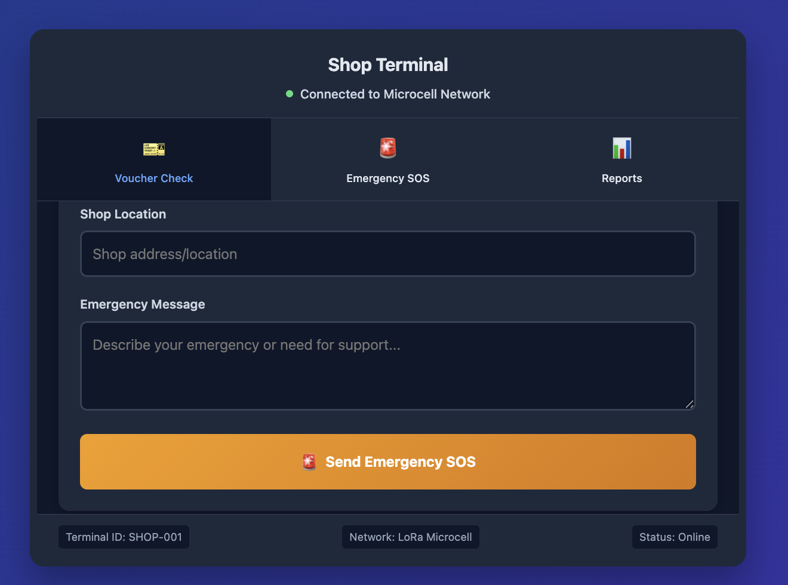

# Emergency MicroCell Mesh Network

Emergency communication that works when everything else fails.

This is a complete offline communication system I built for disaster response scenarios where traditional cellular and internet networks are unavailable.

## ⚠️ Important Disclaimer

**This is a personal, non-profit humanitarian technology project developed independently in my spare time. This project is not affiliated with, endorsed by, or connected to any organization. It is developed as a humanitarian technology initiative with no commercial interests, intended to contribute to global emergency response capabilities.**

## The Problem

During Cyclone Mocha in Bangladesh, I witnessed firsthand how traditional communication networks fail when disasters strike. Cellular networks went down immediately, leaving thousands of people unable to call for help or coordinate relief efforts. This experience highlighted a critical gap in emergency response infrastructure that affects humanitarian operations worldwide.

## The Solution

I developed the **Emergency MicroCell Mesh Network** - a robust, offline-first communication system designed for humanitarian emergency response:

- **25km coverage** using 5 LoRa mesh nodes with self-healing network topology
- **Multi-device compatibility** - works with both smartphones and basic phones
- **Real-time aid verification** - instant voucher validation for distribution systems
- **Emergency SOS messaging** - immediate help requests with location tracking
- **Cost-effective deployment** - $800 per node with 6+ month battery life
- **Scalable architecture** - designed for rapid deployment in disaster zones

## How It Works

### For People in Need
- Smartphone users get a full emergency app interface
- Basic phone users can send SMS through a LoRa bridge (no cellular network needed)
- Anyone can send emergency SOS messages with their location
- Everyone receives real-time emergency alerts

### For Shop Owners
- Instantly verify if aid vouchers are valid
- Send emergency messages if they need support or security
- Get clear instructions on whether to provide food or not

### For Emergency Coordinators
- Monitor the entire microcell network in real-time
- See all emergency messages and coordinate responses
- Send broadcast alerts to everyone in the area
- Connect to existing aid distribution systems

## Technical Overview

### Network Coverage
- 5 microcell nodes covering 25km x 25km area
- Each node covers 5km radius
- Uses LoRaWAN 433MHz with mesh networking

### Technology Stack
- Backend: Python Flask
- Frontend: Mobile-responsive web interface
- Hardware: Raspberry Pi + LoRa modules
- Languages: English and Bengali support

## Screenshots

### Mobile Emergency Interface

*The main mobile interface people use to send emergency messages*

*Emergency SOS form with device type selection*

### Network Monitoring Dashboard

*Real-time view of all 5 microcell nodes and their status*

*Network statistics and connected devices monitoring*

### SMS Interface for Basic Phones

*How people with basic phones can send emergency messages via LoRa bridge*

### Shop Voucher Verification

*Shop owners can instantly verify if aid vouchers are valid*

*Emergency SOS functionality for shop owners*

### Admin Emergency Coordination

*Emergency coordinators monitor everything from this dashboard*

*System statistics and message monitoring*

## Where This Could Help

### Disaster Response
- Cyclone/typhoon emergency communication in coastal areas
- Earthquake response coordination in urban and rural areas
- Flood evacuation and rescue coordination
- Wildfire emergency alerts and evacuation routes

### Humanitarian Aid
- Communication in refugee camps
- Food distribution voucher verification
- Medical emergency response coordination
- Supply chain logistics and inventory management

### Remote Areas
- Rural communities without cellular coverage
- Mountain regions with limited connectivity
- Island communities with unreliable internet
- Desert regions with infrastructure challenges

## Cost Overview

### Per Node Cost
- Total: ~$800 per node
- Includes: LoRa gateway, antenna, solar power, enclosure

### Network Coverage
- 5-Node Network: ~$4,000 total
- Coverage Area: 25km x 25km
- Battery Life: 6+ months
- Maintenance: Minimal

## Project Status

### Completed (MVP)
- **Full-stack web application** with responsive mobile interface
- **Emergency messaging system** with multi-device support
- **Real-time network monitoring** dashboard with live statistics
- **Aid verification system** for distribution coordination
- **Multi-language support** (English/Bengali) for local accessibility
- **Professional UI/UX design** optimized for emergency situations

### In Development
- **Hardware prototyping** - Building actual LoRa microcell nodes
- **Field testing protocols** - Preparing for real-world deployment
- **Performance optimization** - Enhancing network efficiency and reliability
- **Security enhancements** - Implementing encryption and authentication

### Future Roadmap
- **Hardware implementation** - Production-ready LoRa nodes
- **Field deployment** - Real-world testing in disaster scenarios
- **Strategic partnerships** - Collaboration with humanitarian organizations
- **Open source release** - Community-driven development and scaling

## Collaboration Opportunities

### Hardware Engineering Partners
Seeking experienced professionals to help build production-ready LoRa microcell nodes:
- **LoRa/LoRaWAN expertise** - Protocol implementation and optimization
- **Raspberry Pi and Linux systems** - Embedded systems development
- **RF engineering and antenna design** - Signal optimization and range extension
- **Solar power and battery management** - Off-grid power solutions

### Humanitarian Organization Partners
Looking to collaborate with organizations for:
- **Field testing and deployment** - Real-world validation in disaster scenarios
- **Community implementation** - Local adaptation and training programs
- **Policy development** - Regulatory compliance and standards
- **Funding and resources** - Scaling for global deployment

### Technical Development Partners
Seeking developers and engineers for:
- **Software architecture improvements** - Performance and scalability
- **Mobile application development** - Native iOS/Android applications
- **Database optimization** - High-performance data management
- **Security and encryption** - Enterprise-grade security implementation

## Contact Me

### About Me
- Name: Nazmul Nazim
- Location: Bangladesh
- Background: Emergency response systems, humanitarian technology
- LinkedIn: [Your LinkedIn profile]
- Email: [Your email]

### Getting Access
- Main Code: Private repository (available upon collaboration request)
- Demo: This public repository with screenshots and documentation
- Collaboration: Open to hardware engineers, humanitarian organizations, and technical contributors

### How to Get Started
1. Review this demo and documentation
2. Contact me via LinkedIn or email
3. Discuss collaboration opportunities
4. Request access to private repository
5. Join the development team

## Why This Matters

This project could:
- Save lives during disasters worldwide
- Improve emergency response coordination
- Enable communication in remote areas
- Support humanitarian aid distribution
- Build resilient communities in disaster-prone regions

## License & Non-Profit Status

This project is licensed under the MIT License and is developed as a **non-profit humanitarian technology initiative**. 

- **No commercial interests** - This is purely for humanitarian impact
- **Open source** - Code will be made available for public benefit
- **Personal project** - Developed independently in spare time
- **No organizational affiliation** - Not connected to any employer or organization

The main code repository is private for controlled collaboration, but this demo is open for public review and collaboration inquiries.

---

Ready to build emergency communication that works when everything else fails? Let's collaborate!

#EmergencyResponse #HumanitarianTech #DisasterRelief #LoRa #MeshNetworking #TechForGood #EmergencyCommunication #DisasterManagement #Innovation #NonProfit #OpenSource
